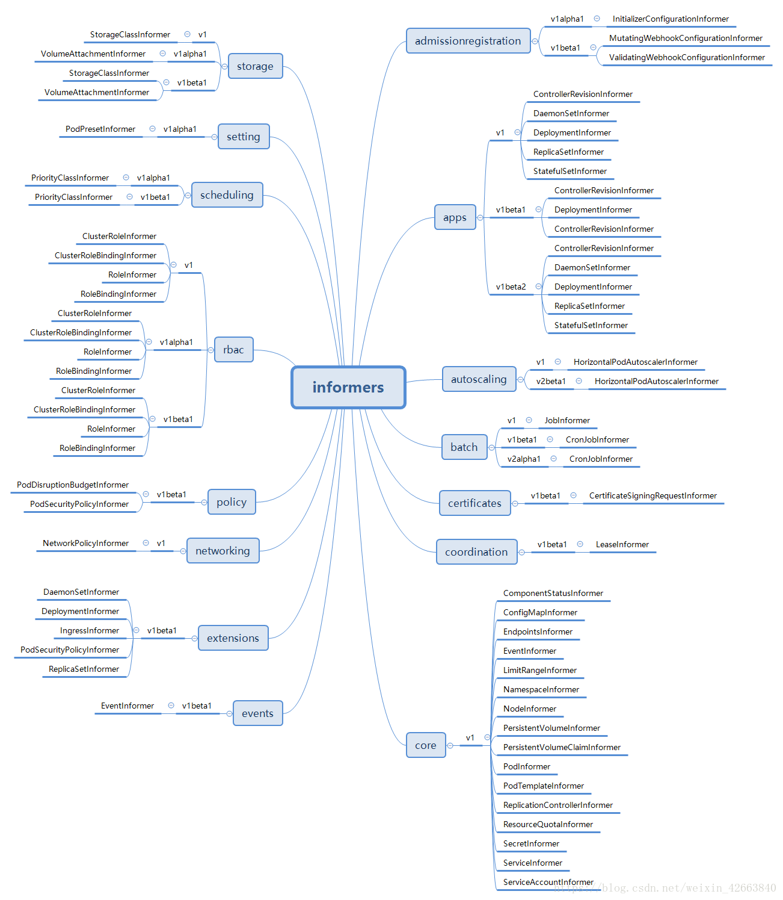

`SharedInformerFactory`可以构造`Kubernetes`里所有对象的`Informer`，而且主要用在`controller-manager`这个服务中。
因为`controller-manager`负责管理绝大部分`controller`，每类`controller`不仅需要自己关注的对象的informer，
同时也可能需要其他对象的`Informer`(比如`ReplicationController`也需要`PodInformer`,否则他无法感知`Pod`的启动和关闭，
也就达不到监控的目的了)，所以一个`SharedInformerFactory`可以让所有的`controller共`享使用同一个类对象的`Informer`。

通过`Informer`获取信息,比如`kube-controller-manager`，这类用户通过调用`Core()、Events()、Storage()`这类的接口获取各个`Informer`分组，
使用者通过`Informer`就可以获取信息，这个后面会有章节介绍；向SharedInformerFactory里面注册Informer的人，比如PodInformer，
这类用户是通过调用类似Core()这些接口而被动触发形成的，他们肯定知道怎么创建自己，由他们负责把自己注册到SharedInformerFactory里面；