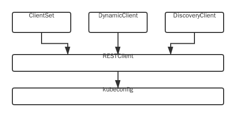

```shell script
.
├── CHANGELOG.md
├── CONTRIBUTING.md
├── Godeps
├── INSTALL.md
├── LICENSE
├── OWNERS
├── README.md
├── SECURITY_CONTACTS
├── code-of-conduct.md
├── deprecated
├── discovery 提供DiscoveryClient发现客户端
├── dynamic 提供DynamicClient动态客户端
├── examples
├── go.mod
├── go.sum
├── informers 每种kubernetes资源的动态实现
├── kubernetes 提供ClientSet客户端
├── kubernetes_test
├── listers 为每一个kubernetes资源提供Lister功能，该功能对Get和List请求提供只读的缓存数据
├── metadata
├── pkg
├── plugin 提供OpenStack、GCP和Azure等云服务商授权插件
├── rest 提供RESTClient客户端,最基础的客户端，对Kuberntes API Server执行RESTful操作
├── restmapper
├── scale 提供ScaleClient客户端，用于扩容或缩容Deployment、ReplicaSet、Replication Controller等资源对象
├── testing
├── third_party
├── tools 提供常用工具，例如Sharedinformer、Reflector、DealtFIFO及Indexers。提供Client查询和缓存机制，以减少向kube-apiserver发起的请求数
├── transport 提供安全的TCP连接，支持Http Stream，某些操作需要在客户端和容器之间传输二进制流，例如exec、attach等操作。该功能由内部的spdy包提供支持
├── tree.md
└── util 提供常用方法，例如WorkQueue工作队列、Certificate证书管理
```
## 客户端
4种客户端：



- RESTClient对HTTP Request进行了封装，实现了RESTful风格的API
- ClientSet在RESTClient的基础上封装了对Resource和Version的管理方案。每一个Resource可以理解为一个客户端，而ClientSet则是多个客户端的集合，每一个Resource和Version都以函数的方式暴露给开发者。ClientSet只能够处理Kubernetes内置资源，它是通过client-gen代码生成器自动生成的
- DynamicClient与ClientSet最大的不同之处是，ClientSet仅能访问Kubernetes自带的资源(即Client集合内的资源)，不能直接访问CRD自定义资源。DynamicClient能够处理Kubernetes中的所有资源对象，包括Kubernetes内置资源与CRD自定义资源
- 